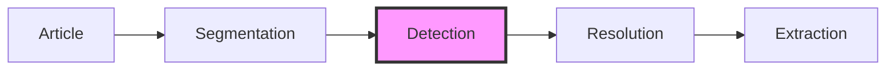

# Entity Detection

The detection stage scans text for surface forms that match
known KG entity aliases. It is pattern matching, not LLM
inference — the resolution stage downstream handles
disambiguation. Detection answers "where in this text might
an entity be mentioned?", not "which entity is it?".


## Role in the pipeline



Detection runs once per chunk and produces `Mention` objects
— each carrying the matched surface form, its character
offsets, and the IDs of every KG entity whose alias matched.
The resolution stage then uses these candidates to build a
focused LLM prompt.


## Why rule-based first?

The detection stage is deliberately simple:

1. **Speed** — alias matching is O(n) per chunk. An LLM call
   per chunk for detection would be orders of magnitude
   slower and more expensive.
2. **Determinism** — same text + same aliases = same mentions.
   No temperature, no prompt sensitivity.
3. **Debuggability** — when a mention is missed, the question
   is "is the alias in the KG?" rather than "why did the LLM
   ignore this paragraph?".
4. **Separation of concerns** — detection finds candidates;
   resolution disambiguates. Each stage can be tested and
   improved independently.

An LLM-based detector could be added later as an alternative
`EntityDetector` implementation for cases where alias
matching is insufficient (e.g. paraphrases, implicit
references like "the tech giant" for Apple).


## The Aho-Corasick algorithm

### The problem

Given thousands of KG aliases, find every occurrence of every
alias in an article. The naive approach — scanning the text
once per alias — is O(n × k) where n is the text length and
k is the number of aliases. With 10,000 aliases, that means
10,000 passes over every article.

### The solution

Aho-Corasick is a multi-pattern string matching algorithm
that finds **all occurrences of all patterns in a single
pass** over the text. It works in two phases.

### Phase 1: Build the trie

A trie (prefix tree) is a tree where each path from root to
a node spells out a string. Given aliases `"fed"`,
`"federal reserve"`, and `"ecb"`:

```
root
 ├─ f
 │  └─ e
 │     └─ d  ◄── match: "fed"
 │        └─ e
 │           └─ r
 │              └─ a
 │                 └─ l
 │                    └─ (space)
 │                       └─ r...e  ◄── match: "federal reserve"
 └─ e
    └─ c
       └─ b  ◄── match: "ecb"
```

Each leaf (or intermediate node) that completes an alias
stores the entity IDs associated with that alias.

### Phase 2: Add failure links

This is what distinguishes Aho-Corasick from a plain trie.
A **failure link** points from each node to the longest
proper suffix of the path so far that is also a prefix of
some other pattern in the trie.

Example: while matching "federal reserve", if we've consumed
"fed" and the next character doesn't continue toward
"federal", the failure link from the "d" node jumps to the
node that matches "fed" as a complete alias — so we emit
that match without restarting from the beginning of the text.

Failure links are computed via a breadth-first traversal of
the trie after all patterns are inserted. Each node's failure
link is derived from its parent's failure link, making the
computation O(total alias characters).

### Phase 3: Scan the text

Walk the text character by character, following trie edges.
At each position:

1. If the current character has a child in the trie, follow
   it.
2. If not, follow failure links until either a match is found
   or we return to the root.
3. If we reach a node that completes one or more aliases,
   emit a mention for each.

**No character is ever re-read.** The scan is O(n + m) where
n is the text length and m is the total number of matches.


## Complexity summary

| Operation          | Time                   | Space                  |
|--------------------|------------------------|------------------------|
| Build trie         | O(Σ alias lengths)     | O(Σ alias lengths)     |
| Compute fail links | O(Σ alias lengths)     | O(number of nodes)     |
| Scan text          | O(n + m)               | O(1) beyond the trie   |

Where n = text length, m = number of matches. The trie is
built once when the `RuleBasedDetector` is initialized, then
reused for every chunk.


## Why not a union regex?

A union regex (`alias1|alias2|...`) achieves similar O(n)
scan time via the regex engine's internal automaton, but:

- **Recompilation** — adding or removing an alias requires
  recompiling the entire pattern. The trie supports
  incremental updates (not yet implemented, but the data
  structure allows it).
- **Scaling** — regex engines have practical limits on
  alternation size. Thousands of aliases can cause slow
  compilation or excessive memory usage.
- **Control** — the trie gives us direct access to match
  metadata (entity IDs, match depth) without post-processing
  regex groups.


## Design decisions

### Case-insensitive matching

All aliases are lowercased when inserted into the trie. The
scan lowercases the input text for traversal but extracts
the surface form from the original text, preserving the
author's casing (e.g. `"The FED"` is detected and stored
as-is, not normalized to `"the fed"`).

### Canonical names are indexed

Entity canonical names (e.g. `"Federal Reserve System"`) are
inserted into the trie alongside explicit aliases. This
ensures detection works even for entities with no aliases
defined yet — the canonical name always acts as a baseline
alias.

### Word-boundary enforcement

A match is only emitted if both the start and end positions
are at word boundaries (start/end of text, or adjacent to a
non-alphanumeric character). This prevents partial matches
like `"app"` inside `"application"` or `"fed"` inside
`"federated"`.

The boundary check is intentionally simple — it does not use
locale-aware word segmentation. For English-language news,
alphanumeric boundaries are sufficient.

### Sorted candidate IDs

When an alias maps to multiple entity IDs (e.g. `"Apple"`
matches both Apple Inc. and AAPL), the candidate IDs are
sorted alphabetically. This ensures deterministic output —
same input always produces the same `Mention` objects, which
simplifies testing and debugging.

### Output ordering

Mentions are sorted by `span_start` ascending, then
`span_end` descending (longer matches first at the same
position). This means at any given position, the most
specific match appears first — useful for downstream stages
that may want to prefer longer matches.


## Module structure

```
pipeline/
├── __init__.py        # Re-exports Chunk, Mention,
│                      # EntityDetector, RuleBasedDetector
├── models.py          # Chunk, Mention dataclasses
└── detection.py       # EntityDetector ABC,
                       # RuleBasedDetector, trie internals
```

Internal components (`_TrieNode`, `_build_trie`,
`_scan_trie`, `_is_word_boundary`) are prefixed with
underscores — they are implementation details, not public
API. Only `EntityDetector`, `RuleBasedDetector`, `Chunk`,
and `Mention` are exported.


## Future extensions

- **LLM-based detector** — an alternative `EntityDetector`
  that uses an LLM to find mentions not covered by alias
  matching (paraphrases, implicit references, coreference).
  Would run after rule-based detection to augment, not
  replace, alias matching.
- **Incremental trie updates** — add/remove aliases without
  rebuilding the entire trie. Useful when the KG is updated
  between pipeline runs.
- **Frequency-weighted candidates** — rank candidate IDs by
  how often the entity appears in recent articles, not just
  alphabetically. This could help the resolution stage
  prioritize likely matches.
