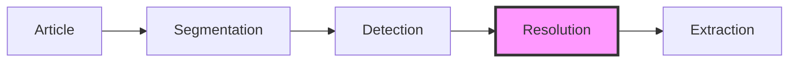
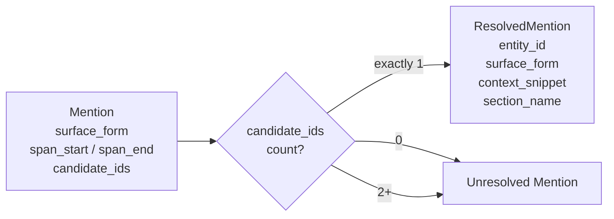

# Entity Resolution

The resolution stage maps detected mentions to concrete KG
entities. It answers "which entity is this mention referring
to?" — the core disambiguation problem of the pipeline.


## Role in the pipeline



Resolution consumes `Mention` objects from the detection
stage and produces `ResolvedMention` objects for persistence
(provenance records) and downstream extraction. Mentions
that cannot be resolved are returned separately for future
LLM-based disambiguation.


## Two-tier resolution strategy

Resolution is split into two tiers by design:

1. **AliasResolver** (baseline) — handles unambiguous
   mentions where exactly one KG entity matches. No LLM
   call needed. Fast, deterministic, free.
2. **LLM-based resolver** (future) — handles ambiguous
   mentions where zero or multiple candidates exist.
   Reads entity descriptions and surrounding context to
   disambiguate.

This separation exists because most mentions in practice
are unambiguous. In a well-populated KG, aliases like
"Bank of England" or "Jerome Powell" typically map to
exactly one entity. Running an LLM call for these would
be wasteful. The AliasResolver handles the easy majority;
the LLM resolver only processes the ambiguous remainder.


## The AliasResolver

### Decision logic

For each mention, the resolver checks the number of
candidate entity IDs (set during detection):

| Candidates | Action | Rationale |
|------------|--------|-----------|
| Exactly 1 | Resolve directly | Unambiguous — alias matches one entity |
| 0 | Leave unresolved | Unknown entity — not in the KG yet |
| 2+ | Leave unresolved | Ambiguous — needs LLM context to decide |

This is deliberately conservative. A mention is only
resolved when there is no ambiguity at all. False
positives (resolving to the wrong entity) are worse than
false negatives (leaving a mention for the LLM to handle),
because wrong provenance records pollute the KG silently
while unresolved mentions are explicitly flagged.

### Context snippet extraction

When resolving a mention, the resolver extracts a context
snippet — a window of text surrounding the mention. This
snippet serves two purposes:

1. **Provenance** — stored alongside the entity link so
   humans can verify the resolution was correct.
2. **Future disambiguation** — if the resolution is later
   questioned, the snippet provides the original context
   without re-reading the full article.

The extraction algorithm:

1. Expand outward from the mention by `context_window`
   characters (default: 100) in each direction.
2. Trim to word boundaries — find the nearest space to
   avoid cutting words in half.
3. Add leading `...` if the snippet doesn't start at the
   beginning of the text.
4. Add trailing `...` if the snippet doesn't reach the
   end of the text.

Example for "Fed" in a long article:

```
Input:  "...monetary policy. The Fed raised rates by
         25 basis points on Wednesday, citing..."
Output: "...monetary policy. The Fed raised rates by
         25 basis points on Wednesday, citing..."
```

The window size is configurable via the `context_window`
parameter. Larger windows provide more context for
provenance but consume more storage.


## Data flow



The `ResolutionResult` groups these into two tuples:
`resolved` (ready for provenance) and `unresolved`
(needs LLM or represents unknown entities).


## Design decisions

### Why not resolve multi-candidate mentions by heuristic?

Heuristics like "pick the most recently created entity"
or "pick the entity with the most provenance records"
would reduce the unresolved count, but they introduce
silent errors. A wrong resolution creates a provenance
record linking an article to the wrong entity — and
there is no downstream stage that would catch this.

The LLM-based resolver will have access to entity
descriptions, article context, and entity type
information to make an informed decision. Until that
exists, it is better to leave ambiguous mentions
explicitly unresolved.

### Why carry section_name through to ResolvedMention?

The section name (e.g. "Q&A", "Prepared Remarks") is
inherited from the chunk. It is carried forward because:

- Provenance records may eventually store section
  information, allowing queries like "which entities
  were mentioned in the Q&A section?"
- The LLM-based resolver may weight sections differently
  (an entity mentioned in prepared remarks is more
  deliberate than one mentioned in Q&A).

### Why return unresolved as Mention objects?

Unresolved mentions are returned as the original
`Mention` objects (not a new type) because:

- They carry all the information the LLM resolver needs
  (surface form, span offsets, candidate IDs).
- No information has been added during resolution — the
  alias resolver simply decided it cannot resolve them.
- Introducing a new `UnresolvedMention` type would add
  complexity without carrying additional data.

### Why is context_window configurable?

Different use cases need different snippet sizes:

- **Storage-constrained**: 50 characters may suffice for
  provenance records in a compact KG.
- **LLM disambiguation**: 200+ characters gives the
  resolver more surrounding context.
- **Human review**: 100 characters (the default) balances
  readability with brevity.

The default of 100 characters on each side was chosen to
capture roughly one sentence of context in each direction
for typical English news prose.


## Module structure

```
pipeline/
├── __init__.py        # Re-exports all public classes
├── models.py          # Chunk, Mention, ResolvedMention,
│                      # ResolutionResult
├── detection.py       # EntityDetector, RuleBasedDetector
└── resolution.py      # EntityResolver, AliasResolver,
                       # _extract_snippet
```


## Future extensions

- **LLM-based resolver** — reads entity descriptions and
  article context to disambiguate multi-candidate mentions.
  Will consume `result.unresolved` from the AliasResolver
  and produce additional `ResolvedMention` objects plus
  `EntityProposal` objects for genuinely new entities.
- **Confidence scoring** — attach a confidence score to
  each resolution so downstream stages can filter or
  weight by reliability.
- **Coreference resolution** — resolve pronouns and
  definite descriptions ("the company", "he") to their
  antecedent entities within the same chunk or across
  chunks via the running entity header.
