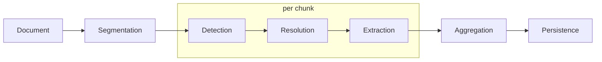

# Document Chunking — Design Decisions

## Purpose

The ingestion pipeline must handle documents that exceed
the LLM context window or that distribute key information
throughout their body rather than front-loading it. This
document describes how documents are segmented into chunks,
how chunks flow through the pipeline, and how results are
aggregated before persistence.

For the core pipeline stages (detection, resolution,
extraction, persistence), see [01_design.md](01_design.md).

## Why truncation is not enough

The baseline pipeline truncates long articles to their
leading paragraphs, relying on the inverted-pyramid
structure of news writing. This works for news but fails
for three document types the pipeline must support:

### Research reports

Equity and macro research reports range from 10 to 50
pages. Key entities are scattered across sections —
comparables in the valuation section, risk exposures in the
risk section, supplier dependencies in the business
overview. Truncating to the first few paragraphs captures
the thesis but misses the entity graph that supports it.

### Earnings call transcripts

Transcripts typically run 5,000-15,000 words and have two
distinct halves: prepared remarks (management narrative)
and Q&A (analyst questions and management responses). The
Q&A often surfaces entities and relationships absent from
prepared remarks — analysts probing a specific competitor,
a pending regulatory action, or a supplier issue.
Truncating loses the Q&A entirely.

### Regulatory filings

10-K filings can exceed 100 pages. Entity-rich sections are
deep in the document: risk factors name competitors,
regulations, and jurisdictions; MD&A discusses products and
markets; legal proceedings reference counterparties. The
executive summary barely scratches the surface.

## Pipeline integration

Chunking adds two stages that bracket the existing four:

- **Segmentation** runs before detection. It produces
  chunks that each flow through the existing pipeline
  stages independently.
- **Aggregation** runs before persistence. It deduplicates
  entities and merges relationships across chunks before
  writing to the KG.

The four core stages (detection, resolution, extraction,
persistence) retain their existing contracts unchanged.
Segmentation and aggregation are the new complexity.

## Document types

Different documents have different natural boundaries. The
segmenter dispatches on document type to select the right
splitting strategy.

| Document type       | Natural boundaries                  |
|---------------------|-------------------------------------|
| News article        | No chunking — truncation suffices   |
| Research report     | Section headers (Executive Summary, |
|                     | Valuation, Risks, etc.)             |
| Earnings transcript | Speaker turns or section boundary   |
|                     | (prepared remarks / Q&A)            |
| Regulatory filing   | Item numbers (Item 1, Item 1A,      |
|                     | Item 7, etc.) — legally             |
|                     | standardized across companies       |

### Why a document type concept is needed

A single segmentation strategy cannot handle all formats
well. Fixed-size splitting breaks semantic coherence;
section-aware splitting requires knowing what a "section"
looks like for each format. The document type tells the
segmenter which parser and splitting logic to use.

### Representing document type

Document type is a property of the document at ingestion
time, not a KG concept. It can be:

- Inferred from the source (an RSS feed produces news
  articles; an SEC EDGAR feed produces filings).
- Explicitly tagged by the caller when submitting documents
  for ingestion.
- Stored on the article record if needed for reprocessing.

The exact mechanism is deferred until the ingestion
interface is built, but the segmenter's contract requires
it as input.

## Segmentation strategy

### Options considered

| Strategy           | How it works                      | Pros                              | Cons                              |
|--------------------|-----------------------------------|-----------------------------------|-----------------------------------|
| Fixed-size         | Split at N tokens with M-token    | Simple, document-agnostic         | Breaks mid-sentence,              |
|                    | overlap                           |                                   | mid-paragraph, mid-argument       |
| Section-aware      | Parse document structure, chunk   | Preserves semantic coherence      | Requires per-format parsers;      |
|                    | by heading or section             |                                   | sections can be huge or tiny      |
| Hybrid             | Section-aware primary, fixed-size | Best of both                      | Most complex to implement         |
|                    | fallback for oversized sections   |                                   |                                   |

### Chosen approach: hybrid with document-type dispatch

Section-aware splitting is the primary strategy because it
preserves semantic coherence — a "Risk Factors" section
stays together, a speaker turn stays together. When a
section exceeds the context budget, it is sub-chunked at
paragraph boundaries (not mid-sentence).

Per document type:

- **News articles**: No chunking. Existing truncation
  to leading paragraphs. The inverted-pyramid assumption
  holds.
- **Research reports**: Split by section header. Large
  sections (e.g. a 10-page Financial Analysis) are
  sub-chunked at paragraph boundaries.
- **Earnings transcripts**: Split by speaker turn or
  major section boundary (prepared remarks / Q&A). Each
  speaker turn is a natural semantic unit.
- **Regulatory filings**: Split by Item number (Item 1,
  Item 1A, Item 7, etc.). These are legally standardized
  and consistent across companies. Large Items are
  sub-chunked at paragraph boundaries.

### Section detection

Each document type needs a parser that identifies section
boundaries. These are relatively simple:

- **Research reports**: Markdown/PDF heading patterns
  (e.g. `## Valuation`, bold section titles).
- **Transcripts**: Speaker labels (`Operator:`,
  `Tim Cook - CEO:`), section dividers.
- **Filings**: `Item N.` patterns, SEC-standardized
  heading text.

Parsers are implementation details of each document type's
segmenter, not part of the pipeline's public contract.

### Chunk metadata

Each chunk carries metadata for downstream stages:

- **chunk_index**: Zero-based position in the document.
- **section_name**: Human-readable section label (e.g.
  "Risk Factors", "Q&A", "Valuation"). `None` for
  fixed-size sub-chunks within a section.
- **document_id**: The parent document's ID (unchanged).
- **token_estimate**: Approximate token count for budget
  checks.

### Overlap

Fixed-size sub-chunking (the fallback for oversized
sections) uses a 10-20% token overlap between consecutive
sub-chunks. This avoids losing entities that straddle a
boundary.

Section-level chunks do **not** overlap — sections are
self-contained semantic units. Cross-section entity
tracking is handled by the running entity header (see
below), not by duplicating text.

## Cross-chunk entity tracking

### The problem

Chunk 1 introduces "Apple Inc." Chunk 5 refers to "the
company." Without context from chunk 1, the LLM processing
chunk 5 may not resolve the reference, or may create a
duplicate entity.

This is the hardest problem in document chunking for entity
extraction. Two complementary mechanisms address it.

### Mechanism 1: document-level alias pre-scan

The rule-based detection stage (alias trie matching) already
exists in the pipeline design. The key change: run it over
the **entire document** before segmentation, not per chunk.

This produces a full candidate entity set for the whole
document. Every chunk then receives the same KG context
window (candidate entities with descriptions and aliases),
regardless of which specific aliases appear in that chunk.

This is cheap — alias trie matching is pure string
processing, no LLM call — and it solves the "which Apple?"
problem: even if chunk 5 only says "the company," the
candidate set already includes Apple Inc. because it was
detected in chunk 1.

### Mechanism 2: running entity header

Each chunk's LLM prompt includes a compact list of entities
detected and resolved in prior chunks. This is a short
structured block (entity name, type, ID) prepended to the
prompt, not full entity descriptions.

This solves long-range coreference: the LLM processing
chunk 5 knows that "the company" likely refers to Apple
Inc. because Apple Inc. is listed as a previously resolved
entity.

The running entity header grows with each chunk but stays
compact — a list of 20-50 resolved entities is a small
fraction of the context budget compared to the chunk text
itself.

### Why not overlap alone?

Chunk overlap handles boundary entities (an entity
straddling two consecutive chunks) but cannot solve
long-range coreference (chunk 1 → chunk 5). The alias
pre-scan and running entity header address both cases.

## Aggregation

### Entity deduplication

The same entity may be detected in multiple chunks. Since
resolution maps mentions to KG entity IDs, deduplication
is straightforward: same `entity_id` means same entity.
Multiple detections produce multiple provenance records
(correct behavior — each records a different context
snippet).

### New entity conflicts

Two chunks may both propose creating a new entity for the
same surface form but with different inferred types or
descriptions. For example, chunk 2 creates "NewCo" as
ORGANIZATION, but chunk 5 encounters "NewCo" with context
suggesting PRODUCT.

Resolution policy:

1. **Same type, different descriptions**: Merge. Use the
   longest description (more context is better for future
   resolution).
2. **Different types**: Flag for review. Do not auto-create
   — conflicting type signals suggest ambiguity that the
   LLM could not resolve.

The running entity header mitigates this by propagating
prior chunk decisions forward, but conflicts can still
occur when later context genuinely contradicts earlier
inferences.

### Relationship merging

Multiple chunks may extract the same relationship with
slightly different `relation_type` strings (e.g. "acquired"
vs "completed acquisition of"). Aggregation deduplicates
on `(source_id, target_id, relation_kind_id)` and keeps
the version with the richest context (longest
`context_snippet` or most specific `relation_type`).

Relationships that share source and target but have
genuinely different relation types are kept as separate
relationships — they represent different facets of the
entity pair's interaction.

## Provenance granularity

### Current state

Provenance links an entity mention to a `document_id` with
a `context_snippet`. This is sufficient for news articles
(short documents, one or two mentions per entity).

### Enhancement for chunked documents

For long documents, knowing *where in the document* a
mention was found adds analytical value. An entity
mentioned in "Risk Factors" carries different signal than
one in "Executive Summary."

Adding a `section_name` field to `Provenance` enables
section-level queries:

- "Which entities appear in Risk Factors across all
  10-K filings?"
- "What relationships were extracted from the Q&A
  portion of this earnings call?"
- "Compare entity mentions in prepared remarks vs Q&A."

This is a small schema addition (one nullable text column)
with meaningful analytical upside.

### What is NOT stored

- **chunk_index**: Internal pipeline detail, not
  analytically useful. Section name is the meaningful
  coordinate.
- **Chunk text**: The full chunk is not stored — the
  `context_snippet` already captures the relevant
  surrounding text for each mention.

## Cost and performance

### The scaling problem

A 30-page research report might produce 10-15 chunks. With
the two-pass pipeline (resolution + extraction), that is
20-30 LLM calls per document — versus 2 for a news
article.

### Mitigations

- **Alias pre-scan filtering**: If the document-level alias
  pre-scan finds zero candidate entities in a section,
  that chunk can be skipped entirely (no LLM call). Legal
  disclaimers and boilerplate rarely contain named entities.
- **Section prioritization**: Not all sections are equally
  entity-rich. The segmenter can tag sections with a
  priority (e.g. Risk Factors = high, Forward-Looking
  Statements disclaimer = skip). High-priority sections
  are processed first.
- **Adaptive early stopping**: If a chunk yields zero new
  entities or relationships, subsequent chunks with lower
  priority can be skipped.
- **Run-level budget**: An ingestion run can have a
  max-LLM-calls cap. The orchestrator processes
  highest-value documents and sections first, stopping
  when the budget is exhausted.

### Local vs API cost profiles

With Ollama (local), cost is measured in time, not money —
more chunks means a longer run but no incremental spend.
With API providers, cost is per-token — the mitigations
above directly reduce spend.

## Module structure

Chunking adds two modules to the pipeline package:

- **segmentation** — `DocumentSegmenter` ABC and
  per-type implementations (`NewsSegmenter`,
  `ResearchSegmenter`, `TranscriptSegmenter`,
  `FilingSegmenter`). Responsible for splitting a
  document into chunks with metadata.
- **aggregation** — `ChunkAggregator` class. Responsible
  for deduplicating entities, merging relationships, and
  flagging conflicts before persistence.

These sit alongside the existing modules described in
[01_design.md](01_design.md).

## What this design does NOT cover

- **PDF/HTML parsing**: The segmenter assumes text input
  with structural markers (headings, speaker labels).
  Converting PDF or HTML to this format is a separate
  preprocessing concern.
- **Semantic chunking via embeddings**: Splitting by
  embedding similarity (grouping semantically related
  paragraphs) is an alternative to section-aware splitting.
  Deferred — section boundaries are more interpretable
  and sufficient for the target document types.
- **Cross-document coreference**: An entity mentioned
  in one document referring to an entity in another
  document. This is handled by KG resolution, not by
  chunking.
- **Streaming / incremental chunking**: Documents are
  chunked in full before processing begins. Streaming
  (processing chunks as they arrive) adds complexity
  without benefit at current scale.
