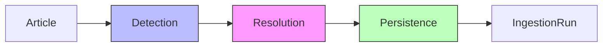

# Pipeline Orchestration

The orchestrator wires the detection, resolution, and
persistence stages into a single callable `Pipeline`
class. Given an `Article` (from `web_scraping`), it
produces `Provenance` records in the `KnowledgeStore`
and tracks the execution in an `IngestionRun`.


## Role in the pipeline



Relationship extraction is intentionally out of scope
for the first iteration. The orchestrator is designed
to slot an `LLMExtractor` in between resolution and
persistence once that ABC exists — no rewrite required.


## Public interface

```python
class Pipeline:
    def __init__(
        self,
        detector: EntityDetector,
        resolver: EntityResolver,
        store: KnowledgeStore,
        *,
        skip_processed: bool = True,
    ) -> None: ...

    def run(
        self, articles: list[Article]
    ) -> PipelineResult: ...

    def process_article(
        self,
        article: Article,
        *,
        run_id: str | None = None,
    ) -> ArticleResult: ...
```

Two result types — both frozen dataclasses:

- **`ArticleResult`** — per-article outcome. Exposes the
  raw `ResolutionResult` (so callers can inspect
  ambiguous mentions), the number of provenance rows
  actually written, a `skipped` flag, and an `error`
  message when article-level processing failed.
- **`PipelineResult`** — aggregate outcome of a run.
  Carries the `run_id`, a tuple of per-article results,
  and the totals for documents processed and provenance
  rows saved.


## Design decisions

### Single-chunk articles

News articles are short (500–3000 words) and not
segmented into semantic sections. Each article becomes
one `Chunk` with `chunk_index=0` and
`section_name=None`. Long-form documents (research
reports, earnings call transcripts) need a chunker
upstream — see [`09_chunking.md`](09_chunking.md) — before
reaching the orchestrator. The orchestrator itself does
not chunk.

### Per-article isolation

An exception raised inside detection, resolution, or
the provenance insert for one article is caught, logged,
and recorded in the per-article `ArticleResult.error`.
The run continues with the next article. A run only
ends in `RunStatus.FAILED` when an exception escapes
the per-article handler — e.g. the store itself going
away mid-run. This matches the policy in
[`01_design.md`](01_design.md#error-handling).

### Provenance-based idempotency

The orchestrator queries
`KnowledgeStore.has_document_provenance(doc_id)` before
processing. Articles whose document ID already has any
provenance row are marked `skipped=True` without
running the detector. Callers that need to reprocess
(e.g. after deleting bad provenance) either delete the
rows first or construct the pipeline with
`skip_processed=False`.

The check hits the existing `idx_prov_document` index,
so per-article cost is a single O(log n) point lookup —
fine for batches of a few hundred articles. If we later
process tens of thousands of articles per run, a
pre-loaded `set[str]` of seen document IDs would be
faster.

### Constructor injection

The detector, resolver, and store are all injected by
the caller. Lifecycle (opening and closing the store,
loading entities into the detector) is the caller's
responsibility. This keeps the orchestrator itself
stateless apart from the injected dependencies, which
in turn:

- lets tests inject stub detectors and resolvers
  without monkey-patching,
- lets callers swap `AliasResolver` for a future
  `LLMResolver` without touching orchestrator code,
- makes the lifetime of the `KnowledgeStore`
  transaction explicit.

### Run bookkeeping

`Pipeline.run()` opens an `IngestionRun` before the
first article, updates it with aggregated counts at the
end, and finalizes the status. `process_article()` is
exposed as a lower-level entry point for callers that
don't need run tracking — notebooks, debug scripts,
one-off ad-hoc processing.

`entity_count` on the run row holds the total number of
provenance rows inserted, not the number of distinct
entities mentioned. This matches the existing semantics
of `finish_run()` and the field's historical use — the
field name is slightly loose, but changing it would be a
KG migration and is deferred.


## Deferred

- **Relationship extraction stage.** Not wired yet. The
  orchestrator has a natural insertion point between
  resolution and persistence.
- **Parallel article processing.** Articles are
  processed sequentially. At current scale there's no
  benefit; parallelism would complicate error isolation
  and the run counters.
- **Streaming input.** The pipeline processes a list,
  not an iterator. Streaming can be added later if news
  ingestion moves to a push model.
- **Per-chunk orchestration.** Once the chunker lands,
  the inner loop will iterate over chunks per article,
  aggregating the resolutions before writing provenance.
  Not required for single-chunk news articles.
