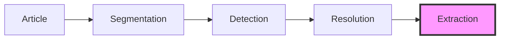
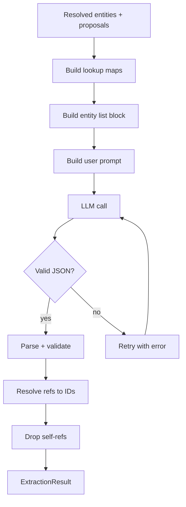
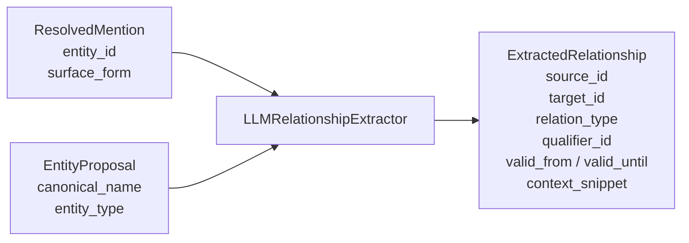

# Relationship Extraction

The extraction stage identifies directed relationships
between resolved entities in the article text. It is
pass 2 of the two-pass LLM pipeline defined in
[03_llm_interface.md](03_llm_interface.md).


## Role in the pipeline



Extraction consumes `ResolvedMention` objects from the
resolution stage (both alias-resolved and LLM-resolved)
plus any `EntityProposal` objects from pass 1. It
produces `ExtractedRelationship` objects for persistence
as KG `Relationship` records.


## Architecture

### ABC: RelationshipExtractor

```python
class RelationshipExtractor(ABC):
    @abstractmethod
    def extract(
        self,
        chunk: Chunk,
        entities: tuple[ResolvedMention, ...],
    ) -> ExtractionResult:
        ...
```

The ABC decouples the pipeline from any specific
extraction strategy. Tests inject fakes; alternative
implementations (rule-based, pattern-matching) can slot
in without touching the orchestrator.

### LLMRelationshipExtractor

The concrete implementation sends chunk text and the
resolved entity list to a language model, which returns
JSON with extracted relationships.

Constructor parameters:

| Parameter        | Type                          | Purpose                                     |
|------------------|-------------------------------|---------------------------------------------|
| `provider`       | `LLMProvider`                 | LLM backend to call                         |
| `entity_lookup`  | `Callable[[str], Entity]`     | Resolve entity ID to `Entity` (for name mapping) |
| `name_lookup`    | `Callable[[str], Entity]`     | Resolve canonical name to `Entity`          |
| `proposals`      | `Sequence[EntityProposal]`    | Pass 1 entity proposals (not yet in KG)     |


## Extract flow



1. **Build lookup maps** -- collect entity IDs and
   canonical names from resolved mentions, KG lookups,
   and proposals into `known_ids` (set) and `name_to_id`
   (dict).
2. **Build entity list block** -- format as "ENTITIES IN
   THIS TEXT:" per `03_llm_interface.md` section "Pass 2
   entity list format".
3. **Compute token budget** -- uses `PASS2_SYSTEM_PROMPT`
   to calculate flexible budget for entity block + text.
4. **LLM call** -- send user prompt with system prompt.
5. **Parse and validate** -- `parse_pass2_response()`
   applies structural and soft validation.
6. **Retry on failure** -- if structural validation fails,
   append error to prompt and retry once (max 2 attempts
   total, same policy as pass 1).


## Validation strategy

Pass 2 validation is split into **hard** (structural) and
**soft** (per-relationship) rules. This differs from
pass 1, which is entirely fail-fast.

### Hard rules (raise Pass2ValidationError)

| Rule | Check | On failure |
|------|-------|------------|
| 1 | `relationships` key exists and is an array | Retry with error feedback |
| 2 | Each entry has `source`, `target`, `relation_type`, `context_snippet` | Retry with error feedback |

### Soft rules (drop + warn)

| Rule | Check | On failure |
|------|-------|------------|
| 3 | Source/target resolves to known ID or canonical name | Drop relationship, log warning |
| 4 | `valid_from`/`valid_until` parse as dates | Set to `None`, keep relationship |
| 5 | Source != target (no self-referential relationships) | Drop relationship, log warning |

### Why the split?

Hard rules indicate the LLM did not understand the
expected output format -- retrying with explicit error
feedback often fixes these. Soft rules indicate valid
output with individual data issues -- retrying the entire
prompt to fix one bad entity reference is wasteful.
Dropping the individual relationship and keeping the rest
is the better trade-off.


## Name resolution

The LLM may reference entities by canonical name instead
of hex ID. From `03_llm_interface.md`:

> The LLM may reference newly proposed entities that
> don't have KG IDs yet. It may also use the canonical
> name from the candidate context rather than remembering
> the hex ID.

Resolution order:

1. **Direct ID match** -- `ref in known_ids` (O(1) set
   lookup).
2. **Canonical name match** -- `name_to_id.get(ref)`.

If neither matches, the relationship is dropped with a
warning (soft rule 3).


## Proposals from pass 1

Entity proposals from pass 1 may not have KG IDs yet when
the extractor runs. The extractor resolves proposal names
via `name_lookup`, which may return the entity if it was
persisted between passes, or `None` if not yet in the KG.

This design means the orchestrator controls whether
proposals are persisted before or after extraction. The
current implementation persists proposals before
extraction, so `name_lookup` will find them.


## Date parsing

Temporal bounds (`valid_from`, `valid_until`) are parsed
at extraction time, not deferred to persistence. Three
formats are supported:

| Format       | Example      | Parsed as              |
|--------------|--------------|------------------------|
| Full date    | `2024-03-20` | `datetime(2024, 3, 20)`|
| Year-month   | `2024-03`    | `datetime(2024, 3, 1)` |
| Year-only    | `2024`       | `datetime(2024, 1, 1)` |

Unparseable values are set to `None` and logged. The
relationship is kept -- temporal bounds are informational,
not structural.

### Why parse at extraction time?

The design doc (`02_models.md`) originally planned to
defer date parsing to persistence. The implementation
parses eagerly because:

- Catching date issues early makes them visible in
  extraction logs alongside other per-relationship
  warnings.
- `ExtractedRelationship.valid_from` as `datetime | None`
  is easier for the orchestrator to work with than raw
  strings that might fail later.
- The three-format parser is simple and deterministic --
  no reason to defer complexity.


## Data flow



The `ExtractionResult` wraps the relationships in a tuple,
following the same pattern as `ResolutionResult`.


## Design decisions

### Why `ExtractedRelationship`, not `Relationship`?

`Relationship` (the KG model) carries persistence metadata
that the extractor should not set:

| Field          | Set by       |
|----------------|--------------|
| `document_id`  | Orchestrator |
| `discovered_at`| Orchestrator |
| `run_id`       | Orchestrator |
| `description`  | Orchestrator (from `context_snippet`) |

Separating the extraction output from the storage model
keeps the extractor focused on what the LLM produced. The
orchestrator converts `ExtractedRelationship` to
`Relationship` during persistence, adding the metadata.

### Why `_id` fields, not `_ref` fields?

The design doc (`02_models.md`) originally planned `_ref`
fields (strings that could be either IDs or names) with
resolution deferred to persistence. The implementation
resolves references at parse time and stores concrete IDs
in `source_id`, `target_id`, and `qualifier_id`. This is
better because:

- The parser already has the lookup maps for validation.
  Resolving immediately avoids a second pass.
- Downstream code (orchestrator, persistence) can trust
  that IDs are valid without re-resolving.
- Unresolvable references are dropped at parse time with
  a warning, not silently carried forward.

### Why `name_lookup` as a separate callable?

The extractor needs two lookups: ID-to-Entity (for
building the name map from resolved mentions) and
name-to-Entity (for resolving name references in the LLM
response). These are separate concerns -- `entity_lookup`
is typically `store.get_entity`, while `name_lookup` is
typically `store.find_by_name`. Combining them into one
callable would conflate two distinct access patterns.

### Why not wire into the orchestrator yet?

The orchestrator docstring explicitly says:

> Relationship extraction is intentionally out of scope
> for this class -- that stage has its own ABC and will
> be added once an `LLMExtractor` exists.

The extraction module and the orchestrator integration are
separate tasks. This separation allows the extraction
module to be reviewed, tested, and refined before
committing to an orchestrator interface.


## Module structure

```
pipeline/
    extraction.py     # RelationshipExtractor ABC,
                      # LLMRelationshipExtractor
    models.py         # ExtractedRelationship,
                      # ExtractionResult
    prompts.py        # PASS2_SYSTEM_PROMPT,
                      # build_entity_list_block(),
                      # build_pass2_user_prompt()
    llm_parsers.py    # Pass2ValidationError,
                      # parse_pass2_response()
```


## Future extensions

- **Orchestrator integration** -- wire
  `LLMRelationshipExtractor` into `Pipeline` as a stage
  after resolution. Convert `ExtractedRelationship` to
  `Relationship` during persistence.
- **Relationship deduplication** -- detect and merge
  duplicate relationships across chunks or articles.
- **Confidence scoring** -- attach extraction confidence
  to relationships so downstream consumers can filter by
  reliability.
- **Few-shot examples** -- improve extraction quality by
  including example relationships in the system prompt.
