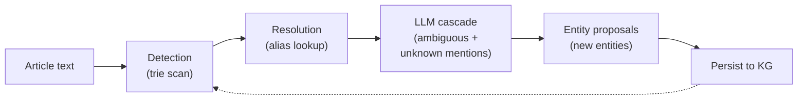

# KG Population Strategy

## The problem

The pipeline detects entity mentions via
`RuleBasedDetector`, which builds an Aho-Corasick trie
from existing KG entities (canonical names + aliases).
With an empty KG, detection finds nothing, the LLM
resolver never fires, and no entities are proposed. This
is a chicken-and-egg problem: the KG must have entities
for the pipeline to find entities.

Once bootstrapped, the KG grows organically: the LLM
resolver proposes new entities it encounters alongside
known ones, and the orchestrator persists them
automatically (see [01_design.md](01_design.md) § "Entity
creation policy").


## Two-phase approach

### Phase 1: Bootstrap (seed the KG)

Seed the KG with a curated set of entities — enough for
detection to start finding mentions in articles. The seed
does not need to be exhaustive; it needs to be
**representative** enough that articles mention at least
some known entities, which triggers the LLM resolver to
discover the rest.

**Recommended seed size:** 50-100 entities covering:

- Major central banks (Federal Reserve, ECB, Bank of
  Japan, Bank of England)
- Top companies by market cap and news frequency (Apple,
  Microsoft, Tesla, JPMorgan, etc.)
- Key indices (S&P 500, Dow Jones, Nasdaq, FTSE 100)
- Prominent policymakers and executives (current Fed
  Chair, heads of state, major CEOs)
- Core metrics (CPI, GDP, unemployment rate, federal
  funds rate)

Each seed entity needs:

- `canonical_name` — the primary display name
- `entity_type` — classification
- `subtype` — finer classification (see
  `docs/knowledge_graph/subtypes.md`)
- `description` — LLM-readable context for resolution
- `aliases` — surface forms found in news text (critical
  for detection coverage)

Good alias coverage is essential for bootstrapping.
"Federal Reserve" should also have "the Fed", "Fed",
"Federal Reserve Board", etc. The more aliases, the more
mentions detection catches, the more context the LLM has
for discovering new entities.

### Phase 2: Organic growth (LLM proposals)

Once the seed is in place, the pipeline grows the KG
automatically:



The cycle is self-reinforcing: new entities from article N
become detection targets for article N+1. Over time, the
KG converges on the entity space covered by the news
sources.

**How proposals work:**

1. Detection finds mentions matching known aliases.
2. `AliasResolver` resolves unambiguous (single-candidate)
   mentions.
3. `LLMEntityResolver` receives unresolved mentions
   (ambiguous or unknown).
4. The LLM identifies entities in the text and either
   resolves them to known candidates or proposes new ones.
5. `_save_proposals()` in the orchestrator creates new
   `Entity` records with `status=ACTIVE` and links them
   to the source article via provenance.

**Quality controls on proposals:**

- Prompt instructs the LLM to only extract "clearly named,
  distinguishable entities" (see `03_llm_interface.md`).
- Pass 1 validation enforces required fields
  (`canonical_name`, `entity_type`, `description`,
  `aliases`).
- KG validation catches temporal inconsistencies and
  alias collisions (see
  `docs/knowledge_graph/validation.md`).
- Full audit trail: every entity has `created_at`,
  provenance linking to the originating article, and
  revision history.

**What proposals don't do (yet):**

- No confidence threshold — all valid proposals are
  persisted. Deferred until API models with logprobs are
  integrated.
- No human review gate — proposals go straight to ACTIVE.
  Appropriate for a proof-of-concept; production use may
  need a review queue.
- No deduplication against semantically similar entities
  — "Apple Inc." and "Apple" could become separate
  entities if the LLM doesn't recognize the overlap.
  The alias collision audit (`find_alias_collisions()`)
  catches some of these.


## Bootstrap implementation

The curated seed lives at
`data/seed/financial_entities.json` and is
version-controlled so the initial KG state is
reproducible. The JSON has a top-level ``entities`` array;
each record has ``canonical_name``, ``entity_type`` (one of
the :class:`EntityType` values), ``description``, and
optional ``subtype`` and ``aliases``:

```json
{
  "version": 1,
  "entities": [
    {
      "canonical_name": "Federal Reserve System",
      "entity_type": "organization",
      "subtype": "central_bank",
      "description": "Central bank of the United States...",
      "aliases": ["Federal Reserve", "The Fed", "FOMC"]
    }
  ]
}
```

The loader CLI (`unstructured_mapping.cli.seed`) reads the
file, parses each record into an :class:`Entity`, and
persists it with ``reason="seed"`` for provenance. The
loader is **idempotent**: it skips entries whose
``canonical_name`` + ``entity_type`` already exist
(case-insensitive), so re-running after a seed update only
writes new rows.

```bash
uv run python -m unstructured_mapping.cli.seed
uv run python -m unstructured_mapping.cli.seed --dry-run
```

Same-name-different-type is allowed (e.g. ``"Gold"`` as
both ``asset`` and ``topic``), so seeds can add a new
flavour of an existing surface form without collision.


## Cold-start LLM mode (future)

An alternative to manual seeding: a pipeline mode that
sends raw article text directly to the LLM for full
entity extraction, bypassing detection entirely. This
would:

- Process articles without any existing KG entities
- Extract all entities the LLM can identify
- Propose them all as new entities

This is more expensive (every article gets an LLM call,
not just those with unresolved mentions) but eliminates
the need for manual seeding. It could be used for initial
population, then switched to the normal detection →
resolution flow once the KG has enough entities.

**Not yet implemented.** The current pipeline requires
detection to produce mentions before the LLM resolver
runs.


## Alternative seed sources

### Wikidata

Wikidata provides structured data for millions of
entities with multilingual labels, descriptions, and
identifiers (tickers, ISIN, FIGI). A Wikidata seed
pipeline would:

1. Query Wikidata SPARQL endpoint for financial entities
   (companies, people, organizations by category).
2. Map Wikidata properties to KG fields (`label` →
   `canonical_name`, `description` → `description`,
   `altLabel` → `aliases`).
3. Persist to the KG with provenance linking to the
   Wikidata QID.

**Trade-offs:**

- **Pro:** Comprehensive coverage, structured data,
  external IDs for joining with price feeds.
- **Con:** Heavy (millions of entities), noisy
  (many irrelevant entities), requires filtering,
  adds Wikidata API dependency.
- **When to use:** When the KG needs broad coverage
  beyond what news articles naturally mention, or when
  external ID linkage (tickers, ISIN) is needed
  immediately.

For a proof-of-concept focused on financial news, the
curated seed approach is faster and more targeted.
Wikidata can be added later when the KG needs to scale
beyond news-driven entity discovery.


## Operational considerations

### When to re-run detection

After bulk entity creation (seed or batch proposals),
the `RuleBasedDetector` trie should be rebuilt from the
updated KG. The detector is constructed from a snapshot
of entities:

```python
detector = RuleBasedDetector(
    store.find_entities_by_status(EntityStatus.ACTIVE)
)
```

Each pipeline run creates a fresh detector, so new
entities from run N are automatically included in run
N+1's detection trie.

### Monitoring KG growth

Track entity count and type distribution after each run
to understand growth patterns:

- `IngestionRun.entity_count` tracks entities found per
  run.
- `count_entities_by_type()` shows type distribution.
- `find_entities_since(dt)` shows recently created
  entities.
- `find_alias_collisions()` flags potential duplicates.

### Handling bad proposals

When the LLM proposes a low-quality entity:

1. **Merge** with the correct entity if it's a duplicate
   (`store.merge_entities()`).
2. **Deprecate** if it's not a real entity
   (`status=DEPRECATED`).
3. **Update** description and aliases if the entity is
   valid but poorly described.

All operations are audited in `entity_history`.
