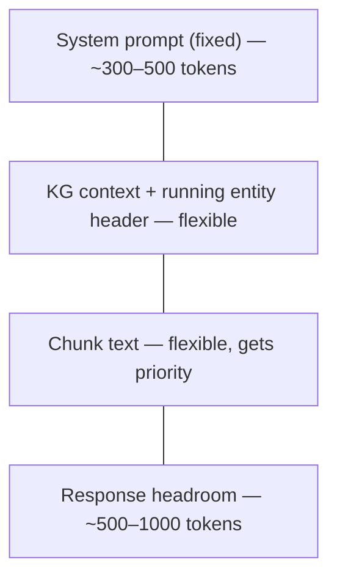

# LLM Interface — Design Decisions

## Purpose

The pipeline makes two LLM calls per chunk: one for entity
resolution (pass 1) and one for relationship extraction
(pass 2). This document defines the JSON schemas the LLM
must produce, how prompts are structured to elicit those
schemas, and how the token budget is managed.

For the pipeline stages that consume these responses, see
[design.md](design.md). For the data models that carry
results between stages, see [models.md](models.md).


## Pass 1 — Entity resolution

### Task

Given the chunk text and a set of candidate entities from
the KG, the LLM must:

1. Identify entity mentions in the text.
2. Resolve each mention to a candidate entity (by ID), or
   propose a new entity if no candidate matches.

### Response schema

```json
{
  "entities": [
    {
      "surface_form": "the Fed",
      "entity_id": "a1b2c3d4...",
      "context_snippet": "...the Fed raised rates by 25bp..."
    },
    {
      "surface_form": "Jerome Powell",
      "entity_id": null,
      "new_entity": {
        "canonical_name": "Jerome Powell",
        "entity_type": "person",
        "subtype": "policymaker",
        "description": "Chair of the Federal Reserve...",
        "aliases": ["Powell", "Fed Chair Powell"]
      },
      "context_snippet": "...Fed Chair Powell announced..."
    }
  ]
}
```

### Field semantics

| Field              | Type           | Required | Meaning                                         |
|--------------------|----------------|----------|-------------------------------------------------|
| surface_form       | string         | yes      | Exact text matched in the chunk                 |
| entity_id          | string \| null | yes      | KG entity ID if resolved; null if new           |
| new_entity         | object \| null | conditional | Required when `entity_id` is null            |
| new_entity.canonical_name | string  | yes      | Proposed authoritative name                     |
| new_entity.entity_type    | string  | yes      | One of the 10 EntityType values                 |
| new_entity.subtype        | string \| null | no  | Finer classification                            |
| new_entity.description    | string  | yes      | Natural-language context for future resolution   |
| new_entity.aliases        | array[string]  | yes | Surface forms observed (including surface_form) |
| context_snippet    | string         | yes      | ~100 chars of surrounding text                  |

### Validation rules

1. `entities` must be an array (may be empty).
2. Each entry must have `surface_form` and
   `context_snippet`.
3. Exactly one of: `entity_id` is non-null, or
   `new_entity` is non-null.
4. If `new_entity` is present, `entity_type` must be a
   valid EntityType value (case-insensitive).
5. `entity_id`, when non-null, must match a candidate ID
   from the prompt's KG context. IDs not in the candidate
   set are rejected (prevents hallucinated IDs).


## Pass 2 — Relationship extraction

### Task

Given the chunk text and the list of resolved entities
(both matched and newly proposed), extract directed
relationships between them.

### Response schema

```json
{
  "relationships": [
    {
      "source": "a1b2c3d4...",
      "target": "e5f6g7h8...",
      "relation_type": "raised",
      "qualifier": null,
      "valid_from": "2024-03-20",
      "valid_until": null,
      "context_snippet": "...the Fed raised rates..."
    }
  ]
}
```

### Field semantics

| Field           | Type           | Required | Meaning                                         |
|-----------------|----------------|----------|-------------------------------------------------|
| source          | string         | yes      | Entity ID or canonical name of the subject      |
| target          | string         | yes      | Entity ID or canonical name of the object       |
| relation_type   | string         | yes      | Free-form relationship label                    |
| qualifier       | string \| null | no       | Entity ID or name for n-ary qualification (typically ROLE) |
| valid_from      | string \| null | no       | ISO 8601 date (or partial: "2024", "2024-03")   |
| valid_until     | string \| null | no       | ISO 8601 date (or partial)                      |
| context_snippet | string         | yes      | ~100 chars of surrounding text                  |

### Why allow canonical names, not just IDs?

The LLM may reference newly proposed entities that don't
have KG IDs yet. It may also use the canonical name from
the candidate context rather than remembering the hex ID.
The persistence stage resolves names to IDs by matching
against the KG and the current run's entity proposals.

### Validation rules

1. `relationships` must be an array (may be empty).
2. Each entry must have `source`, `target`,
   `relation_type`, and `context_snippet`.
3. `source` and `target` must each match either a
   candidate entity ID, a newly proposed canonical name
   from pass 1, or an existing KG canonical name.
   Unresolvable references are dropped with a warning.
4. `valid_from` and `valid_until`, when present, must
   parse as dates. Unparseable dates are logged and the
   field is set to `None` (relationship kept, temporal
   bound dropped).
5. Self-referential relationships (`source == target`)
   are dropped.


## Prompt architecture

### Structure

Both passes use a system prompt + user prompt split:

**System prompt** (fixed per pass):
- Task description (what the LLM must do).
- Output format specification (JSON schema with examples).
- Constraints (only extract named entities, not vague
  references; only extract relationships between the
  provided entities).

**User prompt** (varies per chunk):
- KG context block (candidate entities or resolved
  entities).
- Running entity header (for chunked documents, chunks
  after the first).
- The chunk text itself.

### Why system + user split?

Ollama and API providers both support system prompts.
Placing fixed instructions in the system prompt means
they are not repeated in every user prompt, saving tokens.
It also makes the boundary clear: system = "how to
respond", user = "what to respond about."

### KG context block format

Candidate entities are formatted as a compact text list,
not nested JSON. JSON-in-JSON confuses smaller models.

```
CANDIDATE ENTITIES:

[1] entity_id=a1b2c3d4
    name: Federal Reserve
    type: organization / central_bank
    aliases: the Fed, Federal Reserve, Fed
    description: The central banking system of the
    United States, responsible for monetary policy.

[2] entity_id=e5f6g7h8
    name: Jerome Powell
    type: person / policymaker
    aliases: Powell, Fed Chair Powell, Jerome Powell
    description: Chair of the Federal Reserve since 2018.
```

### Why numbered text blocks, not JSON?

Local models (7B-13B parameter range) produce better
results when the reference material reads like natural
text rather than nested data structures. Numbered entries
make it easy for the LLM to reference specific candidates
("entity [1]") in its reasoning. The entity ID is
explicitly labeled so the LLM can copy it into the
response.

### Running entity header format

For chunked documents, chunks after the first get a
header listing entities already resolved:

```
PREVIOUSLY RESOLVED ENTITIES:
- Federal Reserve (organization, id=a1b2c3d4)
- Jerome Powell (person, id=e5f6g7h8)
- CPI (metric, NEW — proposed in chunk 1)
```

This is deliberately more compact than the KG context
block — just enough for the LLM to recognize references,
not enough to re-resolve from scratch.

### Pass 2 entity list format

Pass 2 receives the resolved entity list (not the full
KG context). This includes both matched KG entities and
newly proposed entities from pass 1:

```
ENTITIES IN THIS TEXT:

- Federal Reserve (organization, id=a1b2c3d4)
- Jerome Powell (person, id=e5f6g7h8)
- CPI (metric, NEW — not yet in KG)
```

The LLM only extracts relationships between entities in
this list. This constrains the output and prevents
hallucinated entity references.


## Token budget

### The constraint

Local models typically have 4K-8K context windows. API
models have larger windows (32K-200K) but cost scales
with token count. The prompt must fit system instructions,
KG context, article/chunk text, and leave room for the
response.

### Budget allocation

The total context window is split into four regions:



**Fixed regions**:
- System prompt: ~300-500 tokens. Stable across chunks.
  Measured once at pipeline startup.
- Response headroom: ~500-1000 tokens. Must accommodate
  the largest plausible response (many entities or many
  relationships per chunk).

**Flexible regions** share the remaining budget:
- KG context and chunk text compete for the remaining
  space.
- Strategy: chunk text gets priority (it is the source
  material). KG context fills the remainder.
- If KG context exceeds its allocation, candidates are
  ranked by alias match count in the chunk and truncated.

### Default budgets

| Model class     | Total context | System | Response | Remaining |
|-----------------|---------------|--------|----------|-----------|
| Ollama 4K       | 4,096         | 400    | 600      | 3,096     |
| Ollama 8K       | 8,192         | 400    | 800      | 6,992     |
| API 32K+        | 32,768        | 500    | 1,000    | 31,268    |

These are starting defaults. The `LLMProvider` ABC reports
its context window size, and the orchestrator computes the
budget from it.

### Token counting

Exact token counts require a model-specific tokenizer,
which adds a dependency and varies across models. The
pipeline uses a **character-based estimate**:

```
token_estimate = ceil(char_count / 4)
```

This is the widely used English-text approximation (1
token ≈ 4 characters). It overestimates slightly for
structured text (JSON, code) and underestimates for
non-Latin scripts — both acceptable for budget checks
where a 10-20% margin is built into the response
headroom.

### Why not use tiktoken or a model tokenizer?

- **tiktoken** is OpenAI-specific. Ollama models use
  different tokenizers (SentencePiece, BPE variants).
- Adding a tokenizer dependency for each model type
  adds complexity without proportional benefit — the
  budget check is a "will this roughly fit?" guard,
  not a precise measurement.
- If a model-specific tokenizer is available via the
  `LLMProvider`, the budget calculator can use it
  opportunistically. The `token_estimate` field on
  `Chunk` and the budget calculator both accept an
  optional tokenizer function.

### Budget exceeded: what happens?

When the combined KG context + chunk text exceeds the
flexible budget:

1. **Truncate KG context first** — rank candidates by
   alias match count in the current chunk, drop the
   least-matched candidates until the context fits.
2. **If still over budget** — the chunk text itself is
   too large. This should not happen if segmentation
   respects the budget, but as a safety net: truncate
   the chunk text to the leading paragraphs and log
   a warning.

KG context is truncated before chunk text because the
chunk is the source material — losing source text is
worse than losing candidate context. The LLM can still
identify entities not in the candidate set (they become
new entity proposals).


## Retry and error feedback

### On validation failure

When the LLM response fails schema validation:

1. **First attempt**: normal prompt.
2. **Retry**: the validation error message is appended
   to the user prompt as a correction instruction:

   ```
   Your previous response had the following error:
   [error description]

   Please correct your response. Output valid JSON
   matching the required schema.
   ```

3. **After two failures**: the chunk is logged as failed
   and skipped. The orchestrator increments the article's
   failure count.

### Why include the error in the retry prompt?

Local models benefit from explicit correction. Telling
the model "your JSON was missing the `entity_type` field"
is more effective than simply re-sending the same prompt
and hoping for different output.

### Retry budget

Each chunk gets at most 2 LLM calls per pass (1 original
+ 1 retry). For a two-pass pipeline, that is at most 4
calls per chunk. This caps the cost of pathological
inputs without being too aggressive — a single retry
resolves most transient formatting errors.


## LLMProvider ABC

### Contract

The `LLMProvider` ABC defines the interface between the
pipeline and any LLM backend:

| Method / property   | Returns          | Purpose                               |
|---------------------|------------------|---------------------------------------|
| `generate(prompt)`  | str              | Send a prompt, get raw text response  |
| `model_name`        | str              | Model identifier for run metadata     |
| `provider_name`     | str              | Provider name for run metadata        |
| `context_window`    | int              | Total token capacity                  |
| `supports_json_mode`| bool             | Whether JSON-constrained output works |

### Why `generate()` returns raw text, not parsed JSON?

Parsing and validation are the pipeline's responsibility,
not the provider's. Different providers handle JSON mode
differently (Ollama uses `format="json"`, API providers
use tool-use or response_format). The provider just
ensures the LLM is asked for JSON; the pipeline validates
whatever comes back.

### OllamaProvider specifics

- Uses the `ollama` Python package.
- Sets `format="json"` for JSON-constrained output.
- Reports `context_window` from the model's metadata
  (Ollama exposes this via the `/api/show` endpoint).
- Timeout: configurable, default 120 seconds per call.


## What this design does NOT cover

- **Exact prompt wording** — templates will iterate as
  we test with real articles and different models. The
  structure (system/user split, KG context format,
  running entity header) is stable; the wording is not.
- **Few-shot examples in prompts** — may improve output
  quality, especially for local models. Deferred until
  baseline quality is assessed.
- **Tool-use / function-calling mode** — API providers
  support structured tool-use as an alternative to
  JSON mode. Can be added as a provider option without
  changing the pipeline's response validation.
- **Streaming responses** — not needed. The pipeline
  waits for the full response before validation.
