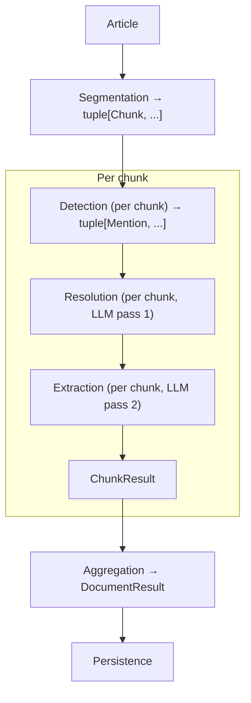

# Pipeline Data Models — Design Decisions

## Purpose

The pipeline passes data between six stages: segmentation,
detection, resolution, extraction, aggregation, and
persistence. This document defines the data classes that
flow between stages — the **stage contracts**. Getting
these right before implementation prevents cascading
refactors when a downstream stage needs a field that an
upstream stage does not produce.

For stage descriptions, see [design.md](design.md). For
chunking-specific flow, see [chunking.md](chunking.md).

## Conventions

All pipeline models follow the same patterns as the KG and
web-scraping models:

- `@dataclass(frozen=True, slots=True)` — immutable, memory
  efficient.
- No `__post_init__` — defaults and field factories handle
  initialization.
- String FKs — no object references across module
  boundaries.
- `tuple[str, ...]` for immutable sequences (not `list`).
- `datetime | None` for timestamps, defaulting to `None`.
- `StrEnum` for closed sets of values.

## IngestionRun

Tracks a single pipeline execution for auditability and
reproducibility.

### Fields

| Field                  | Type              | Default         | Purpose                                          |
|------------------------|-------------------|-----------------|--------------------------------------------------|
| run_id                 | str               | uuid4().hex     | Unique identifier for this run                   |
| status                 | RunStatus         | RUNNING         | Lifecycle: running, completed, failed            |
| started_at             | datetime          | now (UTC)       | When the run began                               |
| ended_at               | datetime \| None  | None            | When the run finished (set on completion/failure) |
| model_name             | str               | —               | LLM model identifier (e.g. "llama3.2")          |
| model_provider         | str               | —               | Provider name (e.g. "ollama", "anthropic")       |
| model_parameters       | str               | "{}"            | JSON-serialized model config (temperature, etc.) |
| articles_total         | int               | 0               | Documents submitted for processing               |
| articles_succeeded     | int               | 0               | Documents that completed all stages              |
| articles_failed        | int               | 0               | Documents that failed at any stage               |
| entities_created       | int               | 0               | New entities added to the KG                     |
| entities_resolved      | int               | 0               | Mentions matched to existing KG entities         |
| relationships_extracted| int               | 0               | Relationships written to the KG                  |
| config_snapshot        | str               | "{}"            | JSON-serialized pipeline configuration           |

### RunStatus enum

| Value       | Meaning                                        |
|-------------|------------------------------------------------|
| RUNNING     | Pipeline is actively processing                |
| COMPLETED   | Run finished (may include per-article failures)|
| FAILED      | Pipeline-level error (DB down, LLM unreachable)|

### Why mutable counters on a frozen dataclass?

`IngestionRun` is the one model that accumulates state
across the entire run. However, it stays frozen — the
orchestrator creates a new instance with updated counts at
the end of the run (or on failure), then persists it. The
intermediate counting happens in the orchestrator's local
variables, not on the dataclass itself.

### Why `model_parameters` and `config_snapshot` as JSON strings?

Frozen dataclasses cannot hold mutable dicts. A JSON string
is immutable, serializable, and can be stored directly in
SQLite without transformation. The pipeline reads these
via `json.loads()` when needed. This is the same pattern
used for `aliases` in `EntityRevision` (JSON array stored
as text).

## IngestionRun storage

The `ingestion_runs` table lives in the KG database (same
SQLite file) because runs are tightly coupled to KG
mutations. See [design.md](design.md) for the rationale.

| Column                 | Type    | Constraint            | Purpose                    |
|------------------------|---------|-----------------------|----------------------------|
| run_id                 | TEXT    | PRIMARY KEY           | UUID hex                   |
| status                 | TEXT    | NOT NULL              | running, completed, failed |
| started_at             | TEXT    | NOT NULL              | UTC ISO 8601               |
| ended_at               | TEXT    |                       | UTC ISO 8601               |
| model_name             | TEXT    | NOT NULL              | LLM model identifier       |
| model_provider         | TEXT    | NOT NULL              | Provider name              |
| model_parameters       | TEXT    | NOT NULL DEFAULT '{}' | JSON config                |
| articles_total         | INTEGER | NOT NULL DEFAULT 0    | Documents submitted        |
| articles_succeeded     | INTEGER | NOT NULL DEFAULT 0    | Documents completed        |
| articles_failed        | INTEGER | NOT NULL DEFAULT 0    | Documents failed           |
| entities_created       | INTEGER | NOT NULL DEFAULT 0    | New KG entities            |
| entities_resolved      | INTEGER | NOT NULL DEFAULT 0    | Matched mentions           |
| relationships_extracted| INTEGER | NOT NULL DEFAULT 0    | Relationships written      |
| config_snapshot        | TEXT    | NOT NULL DEFAULT '{}' | JSON pipeline config       |

Indexes: `status`, `started_at`.

## Chunk

Produced by the segmentation stage. Represents a piece of
a document that flows through detection, resolution, and
extraction independently.

### Fields

| Field          | Type           | Default | Purpose                                         |
|----------------|----------------|---------|------------------------------------------------|
| document_id    | str            | —       | Parent document's ID (from Article)             |
| chunk_index    | int            | —       | Zero-based position in the document             |
| text           | str            | —       | The chunk's text content                        |
| section_name   | str \| None    | None    | Human-readable section label (e.g. "Risk Factors") |
| token_estimate | int            | —       | Approximate token count for budget checks       |

### Why `token_estimate` and not exact count?

Exact token counts require a model-specific tokenizer.
The estimate (character count / 4, rounded up) is
sufficient for budget checks — the goal is "will this
fit?" not "how many tokens exactly?" If a model-specific
tokenizer is available, the segmenter can use it, but the
field contract does not require it.

### News articles as single chunks

For news articles (no chunking), the orchestrator wraps
the article body in a single `Chunk` with `chunk_index=0`,
`section_name=None`, and the full text. This keeps the
downstream stages uniform — they always receive chunks,
whether the document was segmented or not.

## Mention

Produced by the detection stage. Represents a surface form
found in text that may correspond to a KG entity.

### Fields

| Field              | Type              | Default | Purpose                                          |
|--------------------|-------------------|---------|--------------------------------------------------|
| surface_form       | str               | —       | Exact text found (e.g. "the Fed")                |
| span_start         | int               | —       | Character offset where the mention starts        |
| span_end           | int               | —       | Character offset where the mention ends          |
| candidate_ids      | tuple[str, ...]   | ()      | Entity IDs whose aliases matched this form       |

### Why span offsets?

Span offsets enable extracting the `context_snippet` (a
window of text around the mention) without re-scanning.
They also support overlapping mention detection — two
aliases that share a substring can both be recorded with
their exact positions.

### Why multiple candidates?

An alias may match multiple entities. "Apple" matches
both Apple Inc. (ORGANIZATION) and AAPL (ASSET). The
resolution stage disambiguates using the LLM and KG
descriptions.

## EntityProposal

Produced by the resolution stage when the LLM identifies
an entity not in the KG. This is an intermediate
representation — not yet a full `Entity`, because it
has not been validated or persisted.

### Fields

| Field          | Type              | Default | Purpose                                         |
|----------------|-------------------|---------|------------------------------------------------|
| canonical_name | str               | —       | Proposed authoritative name                     |
| entity_type    | EntityType        | —       | Proposed type classification                    |
| subtype        | str \| None       | None    | Proposed finer classification                   |
| description    | str               | —       | LLM-generated context for future resolution     |
| aliases        | tuple[str, ...]   | ()      | Surface forms the LLM observed                  |
| source_chunk   | int               | —       | Chunk index where this entity was first proposed|
| context_snippet| str               | —       | Surrounding text from the originating chunk     |

### Why not create an Entity directly?

Validation must run first — alias collision detection,
type constraints, and (for chunked documents) cross-chunk
conflict resolution. Creating the `Entity` is the
persistence stage's job, after aggregation has resolved
any conflicts between chunks.

## ResolvedMention

Produced by the resolution stage for mentions that matched
an existing KG entity. Links a surface form to a concrete
entity ID.

### Fields

| Field           | Type | Default | Purpose                                        |
|-----------------|------|---------|------------------------------------------------|
| entity_id       | str  | —       | The matched KG entity                          |
| surface_form    | str  | —       | Original text that was resolved                |
| context_snippet | str  | —       | Surrounding text for provenance                |
| section_name    | str \| None | None | Inherited from the chunk                  |

### Why carry `context_snippet` forward?

This becomes the `context_snippet` in the `Provenance`
record. Capturing it at resolution time (when the LLM
has just processed the text) is cheaper than re-extracting
it later.

## ExtractedRelationship

Produced by the extraction stage. An intermediate
representation before persistence validation.

### Fields

| Field           | Type           | Default | Purpose                                       |
|-----------------|----------------|---------|-----------------------------------------------|
| source_ref      | str            | —       | Entity ID or canonical name of the source     |
| target_ref      | str            | —       | Entity ID or canonical name of the target     |
| relation_type   | str            | —       | Free-form relationship label                  |
| qualifier_ref   | str \| None    | None    | Entity ID or canonical name of the qualifier  |
| valid_from      | str \| None    | None    | ISO 8601 date string, if temporal             |
| valid_until     | str \| None    | None    | ISO 8601 date string, if temporal             |
| context_snippet | str            | —       | Surrounding text for provenance               |
| section_name    | str \| None    | None    | Inherited from the chunk                      |

### Why `_ref` fields instead of `_id`?

The LLM may reference entities by canonical name rather
than by ID — especially for newly proposed entities that
don't have an ID yet. The persistence stage resolves
these references to actual entity IDs by matching against
the KG and the current run's `EntityProposal` list.

### Why `valid_from` / `valid_until` as strings?

The LLM produces date strings in its JSON output. Parsing
them into `datetime` objects is the persistence stage's
responsibility — the extraction stage should not fail on
date format variations. If parsing fails, the relationship
is persisted without temporal bounds and logged.

## ChunkResult

Produced by each chunk's pass through detection →
resolution → extraction. Collected by the orchestrator
for aggregation.

### Fields

| Field                   | Type                          | Default | Purpose                                |
|-------------------------|-------------------------------|---------|----------------------------------------|
| document_id             | str                           | —       | Parent document ID                     |
| chunk_index             | int                           | —       | Which chunk produced these results     |
| section_name            | str \| None                   | None    | Section label, if available            |
| resolved_mentions       | tuple[ResolvedMention, ...]   | ()      | Mentions matched to KG entities        |
| entity_proposals        | tuple[EntityProposal, ...]    | ()      | New entities the LLM identified        |
| relationships           | tuple[ExtractedRelationship, ...]| ()   | Relationships extracted                |

### Why separate `resolved_mentions` and `entity_proposals`?

They have different downstream paths:

- `resolved_mentions` → provenance records (direct write).
- `entity_proposals` → validation → entity creation →
  then provenance records.

Mixing them would require the persistence stage to
inspect each item to determine which path to take.

## DocumentResult

Produced by the aggregation stage. The final validated
result for an entire document, ready for persistence.

### Fields

| Field                   | Type                            | Default | Purpose                              |
|-------------------------|---------------------------------|---------|--------------------------------------|
| document_id             | str                             | —       | Which document this covers           |
| resolved_mentions       | tuple[ResolvedMention, ...]     | ()      | Deduplicated resolved mentions       |
| entity_proposals        | tuple[EntityProposal, ...]      | ()      | Validated, conflict-resolved proposals|
| relationships           | tuple[ExtractedRelationship, ...]| ()     | Deduplicated relationships           |
| flagged_conflicts       | tuple[str, ...]                 | ()      | Human-readable conflict descriptions |

### Why `flagged_conflicts`?

When aggregation finds irreconcilable conflicts (e.g. the
same surface form proposed as two different entity types
in different chunks), it excludes those proposals and
records the conflict. These are logged on the run record
and can be surfaced for manual review.

## Data flow summary

| Stage | Input | Output |
|-------|-------|--------|
| Segmentation | Article | `tuple[Chunk, ...]` |
| Detection | Chunk + KG aliases | `tuple[Mention, ...]` |
| Resolution (LLM pass 1) | Chunk.text + Mentions + KG candidates | ResolvedMention(s) + EntityProposal(s) |
| Extraction (LLM pass 2) | Chunk.text + resolved entities | ExtractedRelationship(s) |
| Aggregation | ChunkResult(s) | DocumentResult (dedup entities, merge relationships) |
| Persistence | DocumentResult | Entity, Provenance, Relationship |
